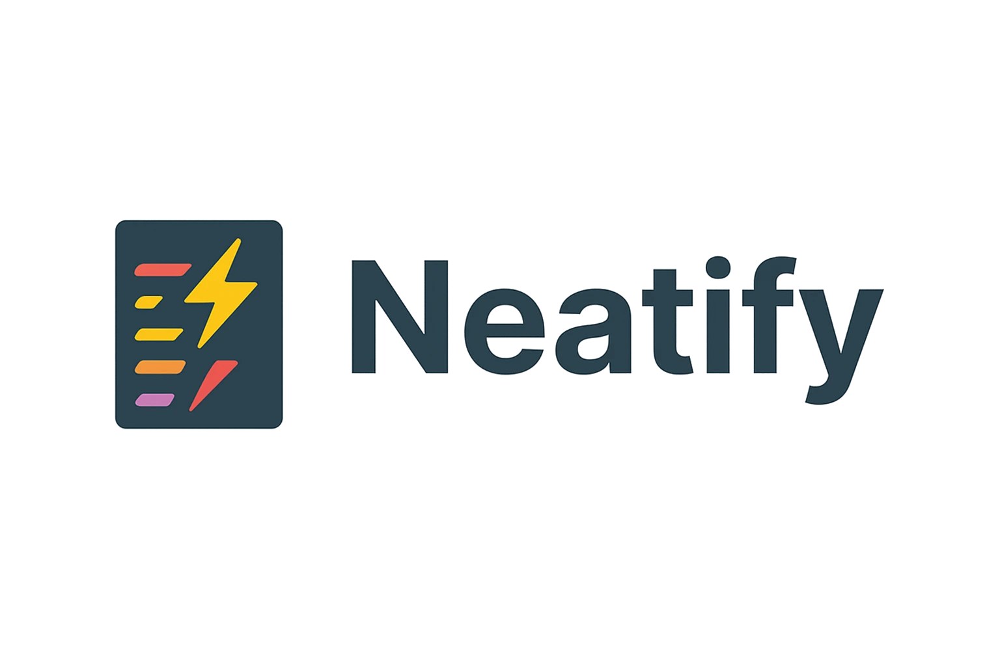

<div align="center">



<div style="display: flex; justify-content: center; gap: 8px; flex-wrap: wrap;">

[](https://crates.io/crates/neatify)
[](https://docs.rs/neatify)
[](https://github.com/neatify/neatify/actions)
[](LICENSE)

</div>

A powerful, extensible code formatter library for multiple languages with a clean API interface.

[Documentation](https://docs.rs/neatify) | [Crates.io](https://crates.io/crates/neatify) | [GitHub](https://github.com/neatify/neatify) | [Changelog](CHANGELOG.md)

</div>

## Features

- **Multi-language Support**: Format code in multiple languages (currently supports JavaScript)
- **Extensible Architecture**: Easily add support for additional languages
- **Clean API**: Simple and intuitive API for integration into applications
- **Error Handling**: Robust error handling with detailed error messages
- **Formatting Statistics**: Get detailed statistics about formatting operations
- **Dry Run Mode**: Check which files need formatting without modifying them
- **Directory Processing**: Format entire directories with a single call
- **Customizable**: Designed to be easily customized for specific needs

## Installation

Add this to your `Cargo.toml`:

```toml
[dependencies]
neatify = "0.1.0"
```

## Usage

### Basic Usage

```rust
use neatify::{format, format_dir};
use std::path::Path;

// Format a single file
fn format_single_file() -> anyhow::Result<()> {
    let file_path = Path::new("path/to/file.js");
    let write = true; // Set to false for dry-run
    
    match format(file_path, write)? {
        true => println!("File needed formatting and was updated"),
        false => println!("File was already formatted"),
    }
    
    Ok(())
}

// Format all supported files in a directory
fn format_directory() -> anyhow::Result<()> {
    let dir_path = Path::new("path/to/directory");
    let write = true; // Set to false for dry-run
    
    let stats = format_dir(dir_path, write)?;
    
    println!("Formatting statistics:");
    println!("  Total files processed: {}", stats.total_files);
    println!("  Files formatted: {}", stats.formatted_files);
    println!("  Files needing formatting: {}", stats.files_needing_formatting);
    
    Ok(())
}
```

### Error Handling

Neatify provides detailed error types for robust error handling:

```rust
use neatify::{format, NeatifyError};
use std::path::Path;

fn handle_formatting_errors() {
    let result = format(Path::new("non_existent.js"), true);
    
    match result {
        Ok(formatted) => println!("Formatting successful: {}", formatted),
        Err(NeatifyError::IoError(e)) => println!("IO Error: {}", e),
        Err(NeatifyError::UnsupportedFile) => println!("File type not supported"),
        Err(NeatifyError::FormattingError(e)) => println!("Formatting failed: {}", e),
        Err(e) => println!("Other error: {}", e),
    }
}
```

## Adding New Formatters

Neatify is designed to be easily extensible. To add support for a new language:

1. Implement the `Tokenizer` trait for your language
2. Implement the `Formatter` trait for your language
3. Register your formatter in the `get_formatter_for_file` function

See the [CONTRIBUTING.md](CONTRIBUTING.md) guide for more detailed instructions.

## Development

### Prerequisites

- Rust 1.56 or higher
- Cargo

### Building

```bash
# Clone the repository
git clone https://github.com/pacmjs/neatify.git
cd neatify

# Build the project
cargo build

# Run tests
cargo test
```

## Contributing

Contributions are welcome! Please feel free to submit a Pull Request.

Please read our [Contributing Guidelines](CONTRIBUTING.md) before submitting a pull request.

## License

This project is licensed under the BSD 3-Clause License - see the [LICENSE](LICENSE) file for details.

## Supported Languages

Currently, Neatify supports the following languages:

- JavaScript (.js, .mjs, .cjs)

### Planned Support

The following languages are planned for future releases:

- TypeScript
- Rust
- Python
- HTML/CSS
- JSON
- YAML

## Acknowledgments

- Inspired by various code formatters like Prettier and rustfmt
- Thanks to all contributors who have helped shape this project